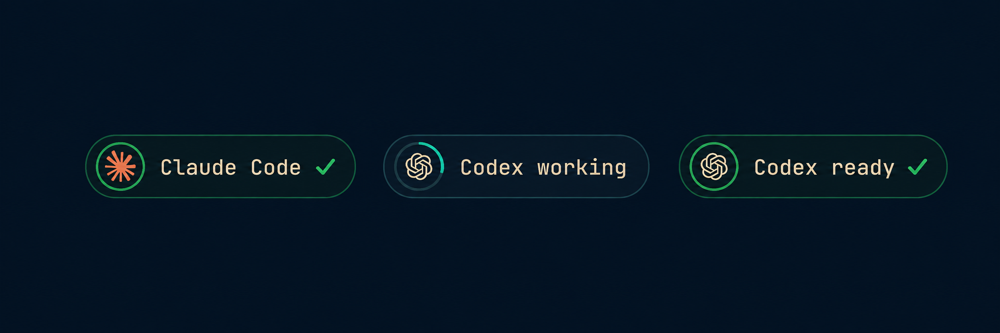

# Agent Status

An Omarchy bar widget that shows your open coding-agent sessions as chips.
Each chip carries the agent's mark, the session name, a ring that spins while
the agent works and a pulse the moment it is waiting for you.


**Supported agents:** Claude Code and Codex. Nothing else is detected yet,
see [Adding an agent](#adding-an-agent).

## Install

```bash
omarchy plugin add https://github.com/mae240/omarchy-agent-status.git --enable
```

Requires Omarchy 4 (Quattro) with a horizontal bar. The widget lands in the
left bar section next to the workspaces. To move it:

```bash
omarchy bar move io.github.mae240.agent-status --section right
```

Claude Code works immediately. For Codex, add the following to
`~/.codex/config.toml` before starting Codex:

```toml
[tui]
terminal_title = ["run-state", "thread-title", "project-name"]
```

Restart any Codex sessions that were already open. Without this setting, Codex
is detectable only while it is working and disappears from the widget when it
becomes idle.

## Remove

```bash
omarchy plugin remove io.github.mae240.agent-status
```

This disables the widget, removes its entry from `~/.config/omarchy/shell.json`
and deletes the plugin directory. The plugin writes nothing else to your system.

## What you see

The chips themselves—not the terminal-title markers used for detection—look
like this:



| State     | Chip                                                           |
|-----------|----------------------------------------------------------------|
| working   | spinning arc, mark and name dimmed                             |
| done      | closed ring and a `✓`, with a short green pulse on the switch  |
| attention | breathing ring and a `!` in the theme's urgent color           |

- Clicking a chip focuses that terminal window.
- Hovering shows the agent, the full session name and its state.
- At most `maxSessions` chips are drawn. The rest is summed up in one `+n`
  chip whose tooltip lists the hidden sessions.
- The chips share a width budget of roughly a quarter of the screen. Names are
  elided sooner while several sessions are open, and when even the shortest
  labels would not fit, fewer chips are drawn and `+n` grows instead. The left
  section never reaches the centered clock.
- The widget hides itself while no session is open and in a vertical bar.

## How detection works

The widget never runs a command and never polls an agent. It only reads the
window title of open terminals, which both CLIs keep up to date, through
Quickshell's toplevel list.

### Claude Code

Works out of the box. Claude Code writes its state into the terminal title.
These glyphs are detection signals; the bar renders the Claude mark and status
ring shown above instead of displaying the glyph itself:

| Title             | Meaning               |
|-------------------|-----------------------|
| `◐ my-session`    | working               |
| `✳ my-session`    | done, waiting for you |

The session name is whatever Claude Code puts after the glyph, usually a short
summary of the conversation. Claude Code does not signal a pending permission
prompt in the title, so a session that waits for your approval looks the same
as one that is still working. Inside tmux, screen or zellij Claude Code writes
the static `✳` all the time, so those sessions always show as done.

### Codex

Codex shows its full state only when its terminal title is configured. Add
this to `~/.codex/config.toml`:

```toml
[tui]
terminal_title = ["run-state", "thread-title", "project-name"]
```

The title then reads `<Run state> | <thread title> | <project>`, which gives
the chip the thread title as its name, the project in the tooltip and the
run state as its status. `Ready`, `Idle` and `Done` count as done; `Waiting`,
`Blocked` and `Approval` as attention; `Working` counts as working. Until Codex
has named the thread the chip reads `Codex`. Note that Codex keeps reporting
`Working` while an approval prompt is open; `Waiting` currently only appears
while it waits on a background terminal, so the attention state is rare.

Without that setting Codex only shows a braille spinner (`⠋ my-session`)
while it works, so the chip can only ever report "working" and disappears as
soon as the run ends.

### Which windows are read

Only terminal windows are parsed: everything `omarchy-launch-tui` opens (app
ids starting with `org.omarchy.` or `TUI.`), the terminals Omarchy ships
(foot, Alacritty, Ghostty, kitty, WezTerm) and the app ids `claude` and
`codex`. Windows of other apps are ignored even when their title happens to
match, so `Inbox | Mail` never becomes a session. A custom
`omarchy-launch-tui --app-id` can be added through the `extraAppIds` setting.

### Not covered

- Any other agent (Gemini CLI, OpenCode, Aider, ...) is not detected.
- A pending approval prompt is not shown as attention for either agent, see
  above.
- Sessions in a terminal multiplexer such as tmux are only seen if the
  multiplexer passes the pane title through to the window title, and Claude
  Code then always shows as done.
- This widget shows session state, not usage or rate limits. For those use
  the built-in `omarchy.agents` widget; both can sit in the bar side by side.

## Settings

Editable in the widget's settings panel, with `omarchy bar set`, or by hand in
the widget's entry in `~/.config/omarchy/shell.json`:

| Key              | Default   | Meaning |
|------------------|-----------|---------|
| `maxWidth`       | `180`     | upper bound for a session name in pixels (60 to 480); the shared budget can elide sooner |
| `maxSessions`    | `4`       | chips before the rest collapses into `+n` (1 to 12) |
| `doneColor`      | `#4ade80` | ring, checkmark and pulse when done |
| `attentionColor` | theme     | ring while a Codex run reports Waiting, Blocked or Approval |
| `claudeColor`    | `#d97757` | Claude mark |
| `codexColor`     | bar text  | Codex mark |
| `extraAppIds`    | empty     | comma-separated extra app ids to read titles from |

Colors take `#RGB`, `#RRGGBB`, `#RRGGBBAA`, `rgb(r,g,b)` or a theme role such
as `accent`, `urgent` or `foreground`. An empty or unreadable value falls back
to the default; numbers outside their range are clamped.

## Adding an agent

Detection lives in one function, `sessionFor(title, appId)` in
`AgentStatus.qml`. It receives a window title and returns `null` or an object
with `agent`, `state` (`busy`, `ready` or `attention`), `name`, `context` and
`detail`. A new agent needs a branch in that function and, for its own mark,
an entry in `AgentMark.qml`. Pull requests are welcome.

## Dependencies

None beyond the Omarchy shell. The widget uses only the Quickshell modules
that ship with Omarchy and runs no external commands.

## Upgrading from `mae.agent-status`

Versions before 2.1.0 used the id `mae.agent-status`. Remove the old copy and
install this one, then move it back to where it was:

```bash
omarchy plugin remove mae.agent-status
omarchy plugin add https://github.com/mae240/omarchy-agent-status.git --enable
```

## Development

```bash
git clone https://github.com/mae240/omarchy-agent-status.git \
  ~/.config/omarchy/plugins/io.github.mae240.agent-status
omarchy plugin validate ~/.config/omarchy/plugins/io.github.mae240.agent-status
omarchy plugin enable io.github.mae240.agent-status
```

After editing the QML run `omarchy restart shell`. The shell's hot reload does
not reliably pick up changed plugin files.

## License

MIT, see [LICENSE](LICENSE). The Claude and OpenAI marks in `AgentMark.qml`
are the vendors' own trademarks and are used only to identify their products.
