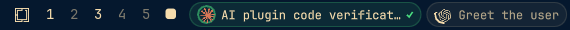

# Agent Status

An Omarchy bar widget that shows every open coding-agent session as a chip:
the vendor's mark, the session name, a ring that spins while the agent works
and a pulse the moment it is done.



## Install

```bash
omarchy plugin add https://github.com/mae240/omarchy-agent-status.git --enable
```

Requires Omarchy 4 (Quattro). The widget lands in the left bar section next to
the workspaces; move it with `omarchy bar move io.github.mae240.agent-status --section right`.

## Remove

```bash
omarchy plugin remove io.github.mae240.agent-status
```

This disables the widget, drops its entry from `~/.config/omarchy/shell.json`
and deletes the plugin directory. Nothing else is written to your system.

## How it works

Nothing is polled and no agent is asked anything. The widget only reads the
terminal title of open windows, which both CLIs keep up to date.

| Agent       | Title                                          | Comes from |
|-------------|------------------------------------------------|------------|
| Claude Code | `◐ <session>` working, `✳ <session>` done, `! <session>` needs a decision | out of the box |
| Codex       | `<Run state> \| <thread title> \| <project>`     | `[tui] terminal_title` in `~/.codex/config.toml` |
| Codex       | `⠋ <session>` while working                     | fallback when no run state is configured |

For the full Codex chip, set:

```toml
[tui]
terminal_title = ["run-state", "thread-title", "project-name"]
```

Only terminal windows are parsed: everything `omarchy-launch-tui` opens
(`org.omarchy.*`, including `org.omarchy.agent`) plus foot, Alacritty, Ghostty,
kitty and WezTerm. That keeps ordinary window titles such as `Inbox | Mail`
out of the bar.

## States

| State     | Chip                                     |
|-----------|------------------------------------------|
| working   | spinning arc, dimmed mark and label      |
| done      | closed ring, `✓`, and a short green pulse on the switch |
| attention | breathing ring and `!` in the theme's urgent color |

Clicking a chip focuses that window.

At most `maxSessions` chips are drawn; anything beyond that is summed up in a
single `+n` chip whose tooltip names the rest. The chips share a width budget
of roughly a quarter of the screen, so names are elided sooner while several
sessions are open and the left section never grows over the centered clock.

## Settings

Editable in the widget's settings panel, with `omarchy bar set`, or by hand in
the widget's entry in `~/.config/omarchy/shell.json`:

| Key              | Default   | Meaning |
|------------------|-----------|---------|
| `maxWidth`       | `180`     | upper bound for a session name; the shared budget can elide sooner |
| `maxSessions`    | `4`       | chips before the rest collapses into `+n` |
| `doneColor`      | `#4ade80` | ring, checkmark and pulse when done |
| `attentionColor` | theme     | ring when the agent needs a decision |
| `claudeColor`    | `#d97757` | Claude mark |
| `codexColor`     | bar text  | Codex mark |

An empty color falls back to the default.

## Dependencies

None beyond the Omarchy shell itself. The widget uses only the Quickshell
modules that ship with Omarchy (`Quickshell.Wayland` for the toplevel list)
and runs no external commands.

## Development

```bash
git clone https://github.com/mae240/omarchy-agent-status.git ~/.config/omarchy/plugins/io.github.mae240.agent-status
omarchy plugin validate ~/.config/omarchy/plugins/io.github.mae240.agent-status
omarchy plugin enable io.github.mae240.agent-status
```

After editing the QML, run `omarchy restart shell`; the hot reload does not
always pick up changed plugin files.

## License

MIT, see [LICENSE](LICENSE). The Claude and OpenAI marks in `AgentMark.qml`
are the vendors' own trademarks and are used only to identify their products.
